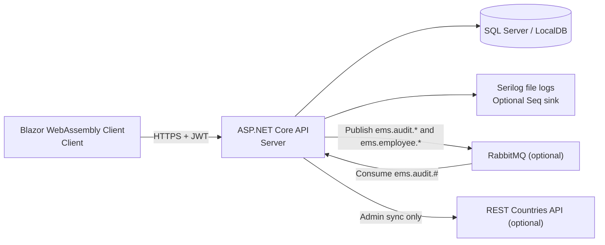

# Employee Management System Solution

## Overview

This repository contains a multi-project .NET 8 employee management system. It is not a distributed order-processing platform. What actually exists here is:

- a Blazor WebAssembly frontend (`Client`)
- an ASP.NET Core Web API backend (`Server`)
- shared DTO/entity libraries (`BaseLibrary`, `ClientLibrary`, `ServerLibrary`)
- SQL Server persistence through Entity Framework Core
- optional RabbitMQ-based audit/event messaging
- unit tests for seeding, employee repository behavior, and country/capital sync services

The application covers:

- authentication with JWT + refresh token
- admin/user role management
- CRUD screens for organization structure, location data, employees, overtime, sanctions, vacations, and doctor records
- an employee feedback screen backed by an ML.NET sentiment model
- optional admin-triggered country/capital sync from the public REST Countries API

There is only one frontend in this repository: the Blazor WebAssembly app. There is no React admin UI, no `package.json`, and no Node.js-based application to run.

## Architecture Summary

### What exists in this repository

| Component | Present? | Notes |
| --- | --- | --- |
| Order API | No | The backend is an employee management API in `Server`, not an order API. |
| RabbitMQ | Yes | Optional. Used for audit events and employee created/updated events. |
| Database | Yes | SQL Server via EF Core. Default local setup targets Windows LocalDB. |
| Inventory Service | No | Not present in this repository. |
| Payment Service | No | Not present in this repository. |
| Shipping Service | No | Not present in this repository. |
| Blazor UI | Yes | `Client` is a Blazor WebAssembly frontend. |
| React Admin UI | No | Not present in this repository. |

### Project responsibilities

| Path | Responsibility |
| --- | --- |
| `BaseLibrary/` | Shared entities, DTOs, and response models used by both client and server. |
| `Client/` | Blazor WebAssembly UI, login/register screens, dashboards, CRUD pages, feedback UI. |
| `ClientLibrary/` | Client-side HTTP/auth helpers and service abstractions used by the Blazor app. |
| `Server/` | ASP.NET Core API host, Swagger, JWT auth, CORS, logging, feedback sentiment service, RabbitMQ audit consumer. |
| `ServerLibrary/` | EF Core `AppDbContext`, migrations, development seeder, repositories, auth implementation, RabbitMQ publisher, country sync services. |
| `Tests/ServerLibrary.UnitTests/` | Unit tests for seeding, employee repository behavior/logging, and country/capital sync services. |

### Diagram



## Event Flow

### 1. Authentication and normal CRUD flow

1. The user opens the Blazor app and signs in at `/identity/account/login`.
2. The client posts credentials to `POST /api/Authentication/login`.
3. The API validates the user, loads the assigned role, issues a JWT + refresh token, and the client stores them in local storage.
4. The Blazor app calls the API for departments, branches, countries, cities, towns, employees, overtime, sanctions, vacations, doctor records, and user management.
5. The API persists data through EF Core into SQL Server.
6. On startup, the API automatically applies pending EF Core migrations.

### 2. Employee event publishing

1. Creating an employee publishes `ems.employee.created`.
2. Updating an employee publishes `ems.employee.updated`.
3. Those messages go to RabbitMQ if the broker is available.
4. No consumer for `ems.employee.*` exists in this repository, so those events are published only. They are not processed further inside this codebase.

### 3. Audit flow

1. Export, print, and employee image-upload actions in the Blazor UI call:
   - `POST /api/audit/export`
   - `POST /api/audit/print`
   - `POST /api/audit/image-upload`
2. `AuditController` logs the action and publishes an `AuditEvent` to RabbitMQ using routing keys under `ems.audit.*`.
3. `EmsAuditConsumer` listens on the `ems.audit` queue with binding key `ems.audit.#`.
4. When RabbitMQ is available, the consumer writes those audit events into the `AuditLogs` table.
5. If RabbitMQ is unavailable, the application still runs, but audit events are not persisted through the queue.

### 4. Feedback flow

1. A user submits feedback from the Blazor feedback page.
2. The client posts the comment to `POST /api/feedback`.
3. The API runs an ML.NET sentiment prediction using `Server/Data/sentiment_data.tsv`.
4. The feedback record and sentiment result are stored in SQL Server.
5. The client can fetch the summary at `GET /api/feedback/summary`.

### 5. Country/capital sync flow

1. An admin user opens the Country page and clicks `Sync Countries` or `Sync Capitals`.
2. The API calls the REST Countries API through a named `HttpClient`.
3. Country, city, and town data are inserted/updated in SQL Server.
4. This feature requires outbound internet access.

## Repository Cloning


If you clone into a different local folder name, use that folder instead of `E-M-S-Solution`.

## Prerequisites

- .NET SDK 8.0.x
  - All projects target `net8.0`.
  - The CI workflow in `.github/workflows/ci.yml` also uses `.NET 8.0.x`.
```bash
 winget install --id Microsoft.DotNet.SDK.8 --exact --source winget
```
- ASP.NET Core HTTPS development certificate
  - The API and Blazor app run on HTTPS localhost URLs.
  - If your machine does not already trust the dev certificate, run:

```powershell
dotnet dev-certs https --trust
```

- SQL Server LocalDB or another SQL Server instance
  - The default connection string in `Server/appsettings.json` points to `Server=(localdb)\MSSQLLocalDB`.
  - This is the easiest path on Windows.
  - On non-Windows machines, or if LocalDB is not installed, you must override the connection string to a reachable SQL Server instance.
- Docker Desktop + Docker Compose v2 (optional)
  - Only needed if you want the RabbitMQ broker defined in `docker-compose.yml`.
  - Docker is not required to run the API or the Blazor app.
- Entity Framework Core CLI tools (optional)
  - Only needed if you want to run EF commands manually instead of relying on the API's startup migration behavior.

```powershell
dotnet tool install --global dotnet-ef
```

- Node.js is not required
  - There is no React app, no `package.json`, and no frontend Node toolchain in this repository.

## Environment Configuration

This repository does not contain `.env`, `.env.example`, or user-secrets configuration. Runtime configuration comes from:

- `Server/appsettings.json`
- `Server/appsettings.Development.json`
- `Server/appsettings.Production.json`
- environment variables
- hard-coded client/server localhost URLs in source

### Recommended local settings

Use `Development` when running locally if you want:

- local RabbitMQ defaults from `Server/appsettings.Development.json`
- automatic demo seeding (`SeedDemoDataOnStartup=true`)

Use these environment variables in the server terminal before `dotnet run`:

```powershell
$env:ASPNETCORE_ENVIRONMENT='Development'
$env:DOTNET_ENVIRONMENT='Development'
```

### Important configuration values

| Setting | Required? | Purpose | Notes |
| --- | --- | --- | --- |
| `ASPNETCORE_ENVIRONMENT` / `DOTNET_ENVIRONMENT` | Yes for the seeded local demo | Loads the Development settings and enables demo seed behavior | The checked-in server launch profiles default to `Production`, so the README uses `--no-launch-profile` on purpose. |
| `ConnectionStrings__DefaultConnection` | Required if you are not using the default LocalDB connection | SQL Server connection string | Default appsettings target `(localdb)\MSSQLLocalDB` and database `EmployeeDB`. |
| `SeedDemoDataOnStartup` | Optional | Controls whether the development seed runs on startup | Set to `true` in `Server/appsettings.Development.json`. |
| `RabbitMQ__HostName`, `RabbitMQ__Port`, `RabbitMQ__UserName`, `RabbitMQ__Password`, `RabbitMQ__VirtualHost`, `RabbitMQ__ExchangeName`, `RabbitMQ__ExchangeType`, `RabbitMQ__QueueName`, `RabbitMQ__RoutingKeyPrefix` | Optional | RabbitMQ broker settings | For local development, `appsettings.Development.json` expects `localhost:5672` with `guest/guest`. |
| `JwtSection__Key`, `JwtSection__Issuer`, `JwtSection__Audience` | Optional for local evaluation, recommended for any real deployment | JWT signing/validation | Values are currently checked into appsettings. Replace them outside source control for any non-demo use. |

### Fixed local URLs in code

Two local URLs are effectively part of the current implementation:

- `Client/Program.cs` hard-codes the API base URL to `https://localhost:7012/`
- `Server/Program.cs` allows CORS only from `https://localhost:7201`

For the Blazor app to talk to the API without changing source code, keep these exact local HTTPS ports:

- API: `https://localhost:7012`
- Blazor app: `https://localhost:7201`

If you change either port, update both source files together.

### RabbitMQ local defaults

If you use the provided compose file, the expected local broker settings are:

| Setting | Value |
| --- | --- |
| AMQP host | `localhost` |
| AMQP port | `5672` |
| Username | `guest` |
| Password | `guest` |
| Management UI | `http://localhost:15672` |

### Seq

Serilog is configured to send logs to `http://localhost:5341`, but this repository does not provide a Seq container or setup script. File logging still works without Seq. Log files are written under `Server/Logs/`.

## Database Setup

### Default local database path (Windows)

The simplest path is:

1. Install SQL Server LocalDB.
2. Use the default connection string from `Server/appsettings.json`, or override it with a fresh database name.
3. Start the API in `Development`.
4. The API will:
   - apply EF Core migrations automatically
   - create the database if needed
   - seed demo data if `SeedDemoDataOnStartup=true`

Example override to force a clean database name:

```powershell
$env:ConnectionStrings__DefaultConnection='Server=(localdb)\MSSQLLocalDB;Database=EmployeeDB_ReadmeDemo;Trusted_Connection=True;MultipleActiveResultSets=true;TrustServerCertificate=True'
```

### Manual EF Core migration command

You do not need this for normal local startup, because `Server/Program.cs` calls `Database.MigrateAsync()` automatically. If you want to run migrations manually, use:

```powershell
dotnet ef database update --project .\ServerLibrary\ServerLibrary.csproj --startup-project .\Server\Server.csproj
```

### Seed data

Development seed data lives in `ServerLibrary/Data/development-seed.json` and includes:

- roles: `Admin`, `User`
- 3 seeded users
- departments, branches, countries, cities, towns
- overtime/sanction/vacation types
- employees
- doctor, overtime, sanction, and vacation records

### Important seed limitation

The development seeder works on a clean database, but it is not safe to replay against arbitrary existing data. If you start the server in `Development` against a reused/partially seeded database, startup can fail with duplicate employee keys such as `IX_Employees_CivilId` or `IX_Employees_FileNumber`.

If that happens, use one of these fixes:

- point `ConnectionStrings__DefaultConnection` to a new database name
- drop the existing database and start again
- disable the seed by setting `SeedDemoDataOnStartup=false`

## Running the Project Locally

### 1. Restore, build, and test from the repository root

```powershell
dotnet restore .\EmployeeManagmentSystemSolution.sln
dotnet build .\EmployeeManagmentSystemSolution.sln
dotnet test .\Tests\ServerLibrary.UnitTests\ServerLibrary.UnitTests.csproj
```

### 2. Optional: start RabbitMQ

If you want audit queue persistence and message publishing to a live broker, start RabbitMQ first. See [Running with Docker](#running-with-docker).

If you skip RabbitMQ, the API still runs. You will see warnings, and audit/employee events are dropped instead of being processed by a broker.

### 3. Start the API in its own terminal

Open a new PowerShell terminal at the repository root and run:

```powershell
$env:ASPNETCORE_ENVIRONMENT='Development'
$env:DOTNET_ENVIRONMENT='Development'
# Optional but useful when you want a guaranteed clean demo DB:
# $env:ConnectionStrings__DefaultConnection='Server=(localdb)\MSSQLLocalDB;Database=EmployeeDB_ReadmeDemo;Trusted_Connection=True;MultipleActiveResultSets=true;TrustServerCertificate=True'
dotnet run --no-launch-profile --project .\Server\Server.csproj --urls "https://localhost:7012;http://localhost:5094"
```

Why `--no-launch-profile` matters:

- the checked-in server launch profiles set `ASPNETCORE_ENVIRONMENT=Production`
- the demo seed and local RabbitMQ settings are under `Development`

Expected API URL:

- Swagger UI: `https://localhost:7012/swagger`

### 4. Start the Blazor client in a second terminal

Open another PowerShell terminal at the repository root and run:

```powershell
dotnet run --no-launch-profile --project .\Client\Client.csproj --urls "https://localhost:7201;http://localhost:5049"
```

Expected client URLs:

- root: `https://localhost:7201/`
- login: `https://localhost:7201/identity/account/login`
- dashboard after login: `https://localhost:7201/home/dashboard`

### 5. Verify the system

Once both processes are running:

1. Open `https://localhost:7201/identity/account/login`
2. Sign in with one of the seeded users listed below
3. Browse the management sections from the left navigation
4. Open Swagger at `https://localhost:7012/swagger` if you want to inspect the API directly

## Running with Docker

Docker support is partial. The repository's `docker-compose.yml` starts only RabbitMQ. It does not start:

- SQL Server
- the ASP.NET Core API
- the Blazor WebAssembly app

### Start RabbitMQ

```powershell
docker compose up -d
```

Services started by this compose file:

| Service | Purpose | Port |
| --- | --- | --- |
| `rabbitmq` | AMQP broker | `5672` |
| `rabbitmq` management plugin | Browser admin UI | `15672` |

RabbitMQ management UI:

- `http://localhost:15672`
- username: `guest`
- password: `guest`

Useful commands:

```powershell
docker compose logs -f rabbitmq
docker compose down
docker compose down -v
```

Notes:

- `docker compose up --build` is not needed here because the compose file only references the published `rabbitmq:3.13-management` image.
- If `docker compose up -d` fails with a Docker pipe/daemon error, start Docker Desktop first and wait until the engine is ready.

## Test Users and Roles

These users are seeded from `ServerLibrary/Data/development-seed.json` when the API starts in `Development` with `SeedDemoDataOnStartup=true`.

| Email | Password | Role | What it can do |
| --- | --- | --- | --- |
| `admin@ems.local` | `Admin123!` | `Admin` | Full authenticated UI access, user management UI, country/capital sync buttons, server-side access to the admin-only country sync endpoints. |
| `hr@ems.local` | `User123!` | `User` | Standard authenticated UI access. |
| `manager@ems.local` | `User123!` | `User` | Standard authenticated UI access. |

Additional auth notes:

- Registering a new account from `/identity/account/register` automatically assigns the `User` role.
- The UI shows admin-only actions through `AuthorizeView`.
- On the server side, the explicit role-based restrictions currently present are on the country sync endpoints and the authenticated audit endpoints.

## End-to-End Smoke Test

If you want to show the system working to an evaluator:

1. Start the API in `Development` and the Blazor app on the default ports.
2. Sign in as `admin@ems.local` / `Admin123!`.
3. Open the dashboard and confirm that seeded data appears in the management sections.
4. Open `Administration -> Users` and confirm the seeded roles/users are visible.
5. Open `Management -> Employees` and create or update an employee.
6. Open `Feedback` and submit a comment to see the sentiment result and summary refresh.
7. If RabbitMQ is running, use export/print/image-upload actions from the UI and then inspect the `AuditLogs` table to confirm async audit persistence.
8. If internet access is available, open the Country page and run `Sync Countries` / `Sync Capitals` as the admin user.

## Running Tests

### Local test command

```powershell
dotnet test .\Tests\ServerLibrary.UnitTests\ServerLibrary.UnitTests.csproj
```

At the time this README was written, the repository test project covered:

- `DevelopmentDataSeeder`
- `EmployeeRepository`
- `CountrySyncService`
- `CapitalSyncService`

There are no frontend unit tests, Playwright tests, or Node-based test suites in this repository.

### CI workflow

`.github/workflows/ci.yml` currently does the following on pushes and pull requests to `master`:

1. restores `EmployeeManagmentSystemSolution.sln`
2. builds the solution in `Release`
3. runs `Tests/ServerLibrary.UnitTests/ServerLibrary.UnitTests.csproj`
4. collects coverage
5. publishes test and coverage artifacts

## Troubleshooting

- Symptom: the server starts without demo users or local RabbitMQ settings.
  Cause: the checked-in server launch profiles set `ASPNETCORE_ENVIRONMENT=Production`.
  Fix: use the README command with `--no-launch-profile` and set `ASPNETCORE_ENVIRONMENT` / `DOTNET_ENVIRONMENT` to `Development`.

- Symptom: startup fails with duplicate key errors such as `IX_Employees_CivilId` or `IX_Employees_FileNumber`.
  Cause: the development seed is running against an existing or partially seeded database.
  Fix: point `ConnectionStrings__DefaultConnection` to a fresh database name, drop the old database, or disable `SeedDemoDataOnStartup`.

- Symptom: `RabbitMQ unavailable` or `EmsAuditConsumer could not connect to RabbitMQ`.
  Cause: the broker is not running on `localhost:5672`.
  Fix: start Docker Desktop, run `docker compose up -d`, or continue without RabbitMQ if you do not need the queue-backed audit flow.

- Symptom: `docker compose up -d` fails with an error about `dockerDesktopLinuxEngine` or the Docker API pipe.
  Cause: Docker Desktop is installed but the daemon is not running.
  Fix: launch Docker Desktop and retry after the engine is healthy.

- Symptom: browser HTTPS warnings, HTTPS bind failures, or localhost certificate errors.
  Cause: the ASP.NET Core development certificate is missing or untrusted.
  Fix: run `dotnet dev-certs https --trust`.

- Symptom: the client loads but API calls fail due to CORS or the UI cannot reach the backend.
  Cause: the API is not on `https://localhost:7012` or the client is not on `https://localhost:7201`.
  Fix: keep the default ports, or update both `Client/Program.cs` and the CORS policy in `Server/Program.cs`.

- Symptom: the API cannot connect to SQL Server at startup.
  Cause: LocalDB is not installed, or you are not on Windows, or the connection string is wrong.
  Fix: install SQL Server LocalDB or set `ConnectionStrings__DefaultConnection` to a reachable SQL Server instance.

- Symptom: `address already in use` on ports `7012`, `5094`, `7201`, or `5049`.
  Cause: another process is already listening on that port.
  Fix: stop the other process, free the port, or change ports and then update the matching client/CORS settings in source.

- Symptom: `Sync Countries` or `Sync Capitals` fails.
  Cause: no outbound internet access or the REST Countries service is unavailable.
  Fix: check connectivity and retry. Core employee-management features do not depend on this external API.

## Assumptions and Limitations

- This repository is an employee management system. It does not contain order, inventory, payment, or shipping services.
- There is one frontend, and it is Blazor WebAssembly. There is no React admin UI.
- Docker support is limited to RabbitMQ. There is no Dockerfile or compose service for SQL Server, the API, or the Blazor client.
- The simplest local path is Windows-centric because the default connection string uses SQL Server LocalDB.
- Demo seeding is a Development-only behavior and is not safe to replay against arbitrary existing data.
- RabbitMQ is optional at runtime. When it is unavailable, the app continues, but queue-backed audit persistence and event delivery do not happen.
- `ems.employee.created` and `ems.employee.updated` are published, but no consumer for those events exists in this repository.
- Seq is configured as a Serilog sink, but the repository does not provide Seq infrastructure.
- Most CRUD controllers are not decorated with `[Authorize]`. Access control is only partially enforced server-side and is more complete in the Blazor UI than in the API surface itself.

## Quick Start

1. Install .NET 8 SDK, SQL Server LocalDB (or another SQL Server instance), and optionally Docker Desktop.
2. Clone the repository.
3. Run:

```powershell
dotnet restore .\EmployeeManagmentSystemSolution.sln
dotnet build .\EmployeeManagmentSystemSolution.sln
dotnet test .\Tests\ServerLibrary.UnitTests\ServerLibrary.UnitTests.csproj
```

4. Optional: start RabbitMQ with `docker compose up -d`.
5. In a new PowerShell terminal, run the API in `Development`:

```powershell
$env:ASPNETCORE_ENVIRONMENT='Development'
$env:DOTNET_ENVIRONMENT='Development'
dotnet run --no-launch-profile --project .\Server\Server.csproj --urls "https://localhost:7012;http://localhost:5094"
```

6. In another terminal, run the Blazor app:

```powershell
dotnet run --no-launch-profile --project .\Client\Client.csproj --urls "https://localhost:7201;http://localhost:5049"
```

7. Open `https://localhost:7201/identity/account/login`.
8. Sign in with `admin@ems.local` / `Admin123!`.
